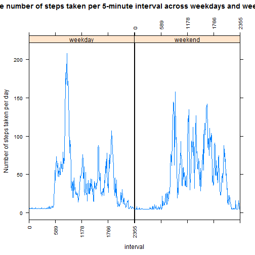

Reproducible research: Peer Assignment 1
========================================================

Loading and preprocessing the data


```r
  data<-read.csv(unz("activity.zip", "activity.csv"), header=T)
  data$interval<-factor(data$interval)
  data$date<-as.Date(data$date,"%Y-%m-%d")
```

What is mean total number of steps taken per day?

```r
  hist(data$steps, xlab="Number of steps taken per day", col="lightgreen",
  main="Before imputing missing data")
```

 

```r
  summary(data$steps) 
```

```
##    Min. 1st Qu.  Median    Mean 3rd Qu.    Max.    NA's 
##     0.0     0.0     0.0    37.4    12.0   806.0    2304
```
What is the average daily activity pattern?

```r
  library("reshape2")
  library("lattice")
  stepmelt<-melt(data,id="interval",measure.vars="steps")
  stepcast<-dcast(stepmelt,interval~variable,mean,na.rm=T)
  ## calculate position and create labels
  x.tick.number <- 5
  at <- seq(1, nrow(stepcast), length.out=x.tick.number)
  labels <- round(seq(0, 2355, length.out=x.tick.number))
  ##plotting
  xyplot(steps~interval,data=stepcast,type="l",ylab="Number of steps taken per day",
         scales=list(x=list(at=at, labels=labels, rot=90)))
```

 

```r
  ##find maximum rows
  max<-as.character(stepcast[which.max(stepcast$steps),1])
  cat("the interval with maximum steps :", max)
```

```
## the interval with maximum steps : 835
```
Imputing missing values

```r
  avg<-mean(data$steps,na.rm=T)
  idata<-data
  for (i in seq_len(nrow(idata))) {
    if(is.na(idata[i,1])) idata[i,1]<-avg
  }
  hist(idata$steps, xlab="Number of steps taken per day", col="orange",
  main="After imputing missing data")
```

 

```r
  summary(idata$steps)
```

```
##    Min. 1st Qu.  Median    Mean 3rd Qu.    Max. 
##     0.0     0.0     0.0    37.4    37.4   806.0
```
Are there differences in activity patterns between weekdays and weekends?

```r
  idata$weekdays<-weekdays(idata$date)
  for (i in seq_len(nrow(idata))) {
    if(idata[i,4]=="Saturday"|idata[i,4]=="Sunday") idata[i,4]<-"weekend"
    else idata[i,4]<-"weekday"
  }
  idata$weekdays<-factor(idata$weekdays)
  stepmelt2<-melt(idata,id=c("interval","weekdays"),measure.vars="steps")
  stepcast2<-dcast(stepmelt2,interval+weekdays~variable,mean)
  ## calculate position and create labels
  x.tick.number <- 5
  at2 <- seq(1, nrow(stepcast2)/2, length.out=x.tick.number)
  labels <- round(seq(0, 2355, length.out=x.tick.number))
  ##plotting
  xyplot(steps~interval|weekdays,data=stepcast2,type="l",ylab="Number of steps taken per day",
         scales=list(x=list(at=at2, labels=labels, rot=90)))
```

 
